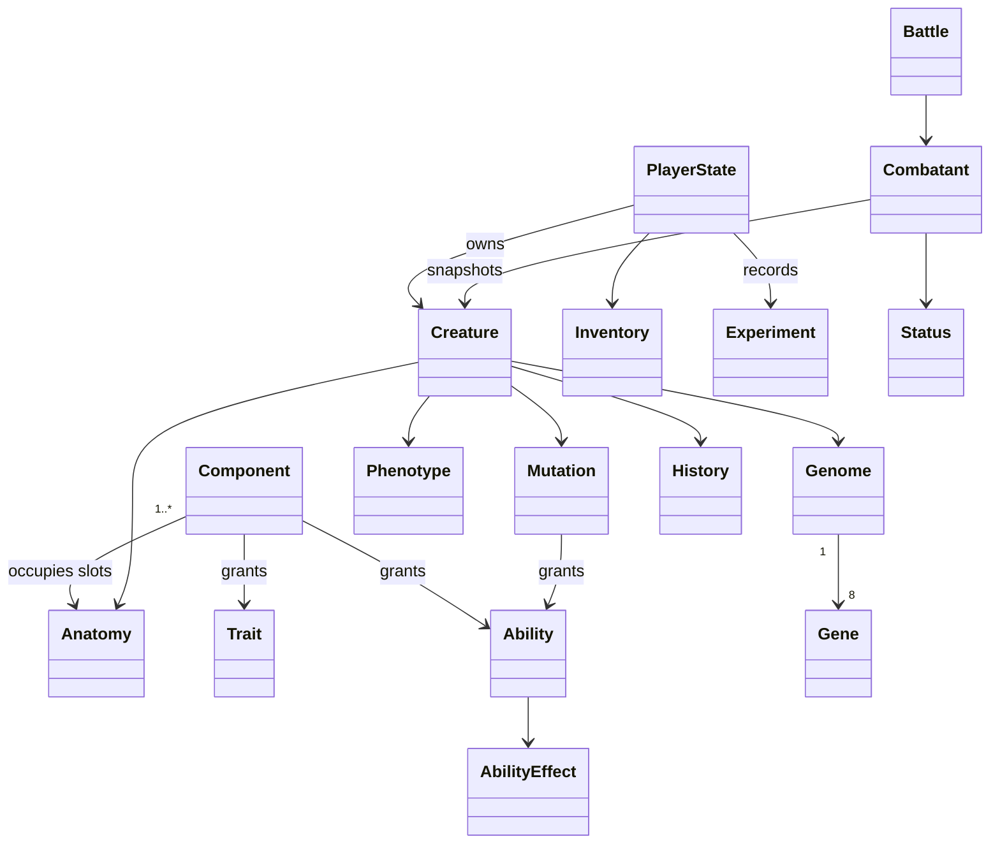

# Monster Workshop: first playable slice

## Scope and technology

The repository initially contained README, license and a Node-oriented ignore file. No existing game systems or engine project were present. This implementation follows specification sections 117 and 120: **only the first vertical slice**, spanning phases 0–5. Phase 5 includes repeatable battle rewards and a sixth discoverable component to close the creation loop. Phases 6–12 remain separate work, gated by playtesting. Breeding specifically needs evidence that creation is fun.

TypeScript, native browser ES modules, semantic HTML/CSS, SVG anatomy, Web Audio and localStorage form a mobile-first single-player game. Node 24 supplies build orchestration, a static development server and unit tests. TypeScript and Node types are development-only dependencies, justified by strict domain checking; Playwright provides browser verification and Prettier provides consistent formatting. There are no runtime libraries. A browser slice allows immediate Android/iOS browser play without requiring native engine tooling; native store packages, 3D rigs and online authority are outside this deliverable. The manifest supports a standalone launch where supported. A build-revision service worker caches the complete shell and catalog after the first online visit. HTTPS is needed when hosted outside localhost.

## Architecture and project structure

```
content/       JSON components, abilities, traits, mutations and balance rules
src/domain/    typed entities, content validation, deterministic generation, combat
src/application/ transactional workshop actions and player-state codec
src/presentation/ SVG anatomy and screen rendering
src/platform/  save adapter, navigation, audio/input feedback, logging/analytics
public/        accessible entry page, styles, manifest, offline shell
tests/         Node domain/property/integration tests and browser scenarios
scripts/       build, local server, simulation tools
docs/          architecture, phase evidence, manual playtest guide
```

Presentation calls application actions; application orchestrates domain rules and injected storage/analytics. Domain has no DOM, network, localStorage or time dependencies. Creature creation receives seed and creation timestamp explicitly. Persisted data is decoded at every write/import boundary. UI changes happen only after the save transaction succeeds.

## Domain model



## Content schema

Every component has stable `id`, display `name`, `slot`, `category`, `rarity`, `element`, `stats`, `genes`, `abilities`, `traits`, `tags`, `compatibleTags`, `conflictTags`, `energyCost`, `weight`, `size`, `mutationChance`, `discovery`, `lore` and `visual` metadata. The visual contains a mesh key (SVG part), anchor, allowed scale/rotation, layer, palette and inherited color blend. Runtime validation rejects invalid slots, missing references, duplicate identifiers and non-finite/negative costs. Adding a component requires a JSON record and a visual asset key; combination logic never contains component IDs.

Abilities have tagged, typed effects (damage/heal/shield/status), power, cost, cooldown and target policy. Traits modify stats or provide affinity. Mutation definitions declare required/excluded tags, probability, gene/stat changes, granted traits/abilities and visual features. Global balance values live in content rules.

## Generation algorithm (version 1)

1. Resolve IDs and normalize anatomy in a fixed slot order. Require head and body, reject duplicate slots or unsupported attachments.
2. Score tag overlap, declared affinities, elemental synergy, energy demand and conflict penalties. Clamp compatibility to 0–100; report individual reasons and stability tier.
3. Seed a documented integer PRNG from a stable hash of the user seed plus sorted anatomy. Roll bounded gene variance around component contributions for eight genes.
4. Sum component stats and apply gene coefficients. Derive dominant element with a stable tie-breaker, traits, abilities and functional roles from data.
5. Evaluate tag predicates on mutations, then roll eligible probabilities. Low compatibility increases mutation opportunity; it never destroys materials without yielding a creature.
6. Calculate quality from stability and genome; quality also determines ability/trait capacity. Apply mutation effects and phenotype features, scales and inherited palette.
7. Produce a reproducible specimen signature. The application gives each manufacture a distinct inventory identity, creation time, name and history. Store the seed and generator version for reproducibility.

The PRNG must never use `Math.random` inside domain generation. Content version and algorithm version are saved; future changes need a migration or a retained old resolver rather than silently rewriting existing creatures. Seeds alone do not describe ownership.

## Save schema

```
{ schemaVersion: 1, savedAt: ISO8601, data: {
  contentVersion: 1, playerName, seedBase, nextSerial, nextBattleSerial, biomass,
  inventory: { componentId: quantity }, discoveredComponents: [id],
  discoveredMutations: [id], creatures: [{
    id, signature, generationVersion, seed, componentIds,
    genome, mutationIds, name, experience, level, training, equipment,
    createdAt, creator, history
  }], experiments: [{ serial, creatureId, componentIds, seed,
    compatibility, mutationIds, createdAt, controlledMutation }],
  claimedBattles: [battleId], activeBattle: null | {
    id, startedAt, round, turnIndex, order, rngState, status, reason, log,
    units: [{ id, team, source: CreatureSource, hp, energy, shield, statuses, cooldowns }]
  }, nextExpeditionSerial, resources: { resourceId: quantity },
  expeditions: [{ id, serial, regionId, source: CreatureSource, seed, elapsedMs, startedAt }],
  expeditionReports: [{ id, regionId, creatureId, outcome, reward }],
  completedResearch: [nodeId], scans: [{ componentId, level, scannedAt }],
  options: { sound, haptics, reducedMotion, textScale }
}}
```

Derived stats, roles, phenotype and ability pool are reconstructed from source data, never trusted from imported saves. Battle units retain creature sources as well as transient HP/status/energy state; their stat snapshots are recalculated at decoding. Phase 4 schema-1 saves migrate missing `activeBattle` to null. Schema and content versions are explicit; unknown versions fail visibly while preserving raw saves. The local adapter retains a previous-write backup. Export/import allows manual portability. Single-player local data cannot protect against deliberate editing or manual rollback; no multiplayer/trading authority is implied.

## Mutation architecture

Rules evaluate tags rather than hard-coded recipes. The slice has one rare, discoverable **Electrical Overgrowth** mutation. An explicit developer simulation can force it, while player generation uses the normal seeded roll. Discoveries enter the codex and immutable experiment records. Preview shows anatomy and predictions; it does not reveal the random outcome before manufacture.

## Combat architecture

Use a pure turn resolver over immutable battle snapshots: three owned creatures versus three data-defined laboratory opponents. Sort by speed each round (including slow), break ties with stable IDs and skip defeated units. Actions validate actor, target, learned ability, energy and cooldown before changing state. Basic attack remains available so combat cannot stall. `damage = max(1, round(raw / (1 + armor * armorFactor) * resistance * criticalMultiplier))`. Shield absorbs before HP. Burn/poison/regeneration tick at the affected unit's turn start; duration decrements after its action. Shock/weakness reduce outgoing damage. Cooldown N blocks the next N own turns. Energy recovers at turn start. Every player action and all ensuing AI turns are one persisted transaction. Defeat is temporary and never deletes creatures. Retreat grants no resources. A terminal battle produces a unique reward claim; application credits materials and the wing discovery once. A round limit prevents endless healing loops. No later-phase reactions, bosses or tower.

## Phase plan and acceptance

0. Foundation: strict compilation, static shell, navigation, storage backup/error handling, data loader, feedback and local telemetry. Test platform adapters and run shell.
1. Domain: all requested creature entities, catalog and save validation, source serialization; invalid-data and roundtrip tests.
2. Generator: deterministic anatomy, compatibility, genes, stats, mutation, quality. Property tests across seeds/combinations and probability simulation.
3. Visuals: modular anchored SVG assembly, inherited materials, size rules and idle preview; test renderer and inspect actual browser output.
4. Workshop: inventory/storage, touch component selection, prediction, manufacture/reveal/rename, codex and experiment log. Test atomic operations and reload.
5. Combat: full 3v3 action loop, abilities/statuses, victory/defeat, repeatable rewards and new wing discovery. Unit/combat/property tests, economy loop simulation, mobile browser tests and offline reload. Document milestone reviews and known limits, commit completed phase.

6. Exploration: biome gathering, specialization, prerequisites, resource storage and reusable discoveries; verify all regions, clock behavior, transactional claims and phone/desktop rendering.

7. Research: observation-gated tree, progressive component scans, reusable biological blueprints, mutation analysis and paid guided creation; verify the entire tree from a fresh save and browser progression.

Each phase gets its own commit after checks pass. Following the first-slice delivery, the user requested continued implementation. Breeding retains the plan's explicit enjoyable-creation-loop gate.

## Exploration architecture

Regions and resources live in the catalog. Region dependencies are checked for cycles and references. Requirements use creature biology tags and stats. Fitness is a weighted blend of tag affinity, adaptation genes and speed, with all coefficients in content rules. A snapshot at departure fixes fitness for the assignment. Rewards are recomputed from this source and seed, and the first region discovery is guaranteed. Starter restocks remain biome-specific; battle rewards do not replenish expedition components.

A creature can occupy one expedition or one battle team at a time. Each assignment has a monotonic serial identity; collecting or recalling moves it into a report ledger. Claims update currency, resources, components, discovery, experience and assignment state in one validated save. Failed writes roll back all changes. Decoding rejects duplicate assignments/claims, impossible progress and mismatched ownership/snapshots.

The browser supplies at most one second of foreground `performance.now()` progress per tick. Visibility changes reset the interval baseline; background suspensions and closed-game wall time grant no progress. No duration is derived from `Date.now()` or saved timestamps. The paused behavior is explicit in the UI. Additive schema-1 migration initializes missing expedition fields while retaining existing creature sources and content version 1.


## Research architecture

Research nodes declare costs, acyclic dependencies, objective counts and a typed unlock. Capabilities are derived from completed nodes; UI checks and application actions share the same requirement functions. Scans preserve the current revealed level and date per discovered component. Basic analysis returns a projection with no gene biases, affinities, traits or mutation probability; advanced analysis returns isolated copies of those properties. Reveals never modify existing components or creatures.

Unlocking anatomy gives samples and a reusable cultivation recipe, creating a repeatable use for gathered resources. Mutation Atlas exposes rules only for previously observed mutations and upgrades recipe forecasts from qualitative estimates to numeric probability. Mutation control uses the existing generator's eligible force option after checking research, prior discovery, anatomy and extra costs. The source stores the resulting genome/mutations, while the experiment records the controlled mutation. Older experiment records default to natural creation. Existing generation rules and creature source formats remain unchanged.

Save decoding verifies research prerequisites/objectives, scanner capabilities, discovered-sample ownership, blueprint discoveries and guided experiment authorization. All resource spending and knowledge changes cross the same save boundary; telemetry follows successful writes.
