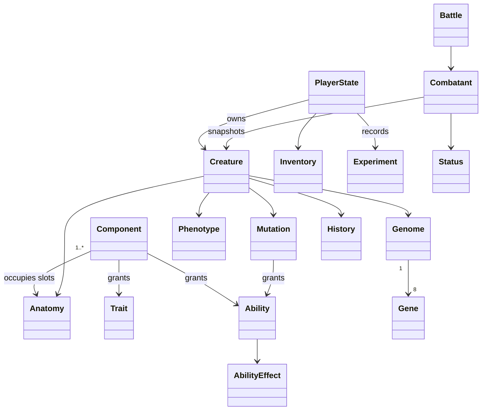

# Monster Workshop architecture

## Scope and technology

The repository initially contained README, license and a Node-oriented ignore file. Implementation began with the phases 0-5 vertical slice required by specification sections 117 and 120. The user's successive continuation instructions authorized phases 6-12, including proceeding past the breeding gate. All thirteen implementation phases are now complete, with separate commits and recorded validation. Human playtesting remains a release acceptance step.

TypeScript, native browser ES modules, semantic HTML/CSS, SVG anatomy, Web Audio and localStorage form a mobile-first single-player game. Node 24 supplies build orchestration, a static development server and unit tests. TypeScript and Node types are development-only dependencies, justified by strict domain checking; Playwright provides browser verification and Prettier provides consistent formatting. There are no runtime libraries. A browser slice allows immediate Android/iOS browser play without requiring native engine tooling; native store packages, 3D rigs and online authority are outside this deliverable. The manifest supports a standalone launch where supported. A build-revision service worker caches the complete shell and catalog after the first online visit. HTTPS is needed when hosted outside localhost.

## Architecture and project structure

```
content/       JSON components, abilities, traits, mutations and balance rules
src/domain/    typed entities, content validation, deterministic generation, combat
src/application/ transactional workshop actions and player-state codec
src/presentation/ SVG anatomy and screen rendering
src/platform/  save adapter, navigation, audio/input feedback, logging/analytics
public/        accessible entry page, styles, manifest, offline shell
tests/         Node domain/property/integration tests and browser scenarios
scripts/       build, local server, simulation tools
docs/          architecture, phase evidence, manual playtest guide
```

Presentation calls application actions; application orchestrates domain rules and injected storage/analytics. Domain has no DOM, network, localStorage or current-clock reads; time calculations use explicit timestamps. Creature creation receives seed and creation timestamp explicitly. Persisted data is decoded at every write/import boundary. UI changes happen only after the save transaction succeeds.

### Multiple-tab persistence

Before loading a workshop, the browser requests an exclusive writer lock for the shared save key. The lock remains held through normal gameplay and save recovery. Other tabs display a waiting screen, run no gameplay timers and read the latest save only after acquiring ownership. Closing or leaving a document releases ownership and aborts pending requests; returning from a cached page reloads and reacquires ownership. The lock callback's lifetime follows the [Web Locks specification](https://www.w3.org/TR/web-locks/#api-lock-manager).

The save repository also compares the current primary bytes with its last observed record before touching either primary or backup. Missing and damaged records establish baselines too, while a repository that has not loaded expects an empty primary. Changed data raises a dedicated conflict error without mutating memory, storage or telemetry. Gameplay, timers, retries, imports, backup restores and recovery resets all cross this boundary. Startup and recovery conflicts display a reload action rather than offering to replace newer progress.

Storage events pause stale UI sessions, cancel pending reveals and require loading the latest workshop. Timer and asynchronous file handlers stop when their document leaves or becomes stale. Browsers without Web Locks still use conflict detection and storage events, but their read/compare/write sequence is not atomic across tabs: use one active tab there. A browser that exposes locks but rejects coordination shows a retry screen and preserves saved data.

## Domain model



## Content schema

Every component has stable `id`, display `name`, `slot`, `category`, `rarity`, `element`, `stats`, `genes`, `abilities`, `traits`, `tags`, `compatibleTags`, `conflictTags`, `energyCost`, `weight`, `size`, `mutationChance`, `discovery`, `lore` and `visual` metadata. The visual contains a mesh key (SVG part), anchor, allowed scale/rotation, layer, palette and inherited color blend. Runtime validation rejects invalid slots, missing references, duplicate identifiers and non-finite/negative costs. Adding a component requires a JSON record and a visual asset key; combination logic never contains component IDs.

Abilities have tagged, typed effects (damage/heal/shield/status), power, cost, cooldown and target policy. Traits modify stats or provide affinity. Mutation definitions declare required/excluded tags, probability, gene/stat changes, granted traits/abilities and visual features. Global balance values live in content rules.

## Generation algorithm (version 1)

1. Resolve IDs and normalize anatomy in a fixed slot order. Require head and body, reject duplicate slots or unsupported attachments.
2. Score tag overlap, declared affinities, elemental synergy, energy demand and conflict penalties. Clamp compatibility to 0–100; report individual reasons and stability tier.
3. Seed a documented integer PRNG from a stable hash of the user seed plus sorted anatomy. Roll bounded gene variance around component contributions for eight genes.
4. Sum component stats and apply gene coefficients. Derive dominant element with a stable tie-breaker, traits, abilities and functional roles from data.
5. Evaluate tag predicates on mutations, then roll eligible probabilities. Low compatibility increases mutation opportunity; it never destroys materials without yielding a creature.
6. Calculate quality from stability and genome; quality also determines ability/trait capacity. Apply mutation effects and phenotype features, scales and inherited palette.
7. Produce a reproducible specimen signature. The application gives each manufacture a distinct inventory identity, creation time, name and history. Store the seed and generator version for reproducibility.

The PRNG must never use `Math.random` inside domain generation. Content version and algorithm version are saved; future changes need a migration or a retained old resolver rather than silently rewriting existing creatures. Seeds alone do not describe ownership.

## Save schema

```
{ schemaVersion: 1, savedAt: ISO8601, data: {
  contentVersion: 1, playerName, seedBase, nextSerial, nextBattleSerial, biomass,
  inventory: { componentId: quantity }, discoveredComponents: [id],
  discoveredMutations: [id], creatures: [{
    id, signature, generationVersion, seed, componentIds,
    genome, mutationIds, name, experience, level, training, equipment,
    createdAt, creator, history, lineage?
  }], experiments: [{ serial, creatureId, componentIds, seed,
    compatibility, mutationIds, createdAt, controlledMutation }],
  claimedBattles: [battleId], activeBattle: null | {
    id, startedAt, round, turnIndex, order, rngState, status, reason, log, challenge?,
    units: [{ id, team, source: CreatureSource, hp, energy, shield, statuses, cooldowns }]
  }, nextExpeditionSerial, resources: { resourceId: quantity },
  expeditions: [{ id, serial, regionId, source: CreatureSource, seed, elapsedMs, startedAt }],
  expeditionReports: [{ id, regionId, creatureId, outcome, reward }],
  completedResearch: [nodeId], scans: [{ componentId, level, scannedAt }],
  births: [{ childId, parents: [CreatureSource, CreatureSource] }],
  breedingCooldowns: { parentId: remainingMs }, towerFloor, bossVictories,
  sales: [{ creatureId, orderSerial, biomass, resources }], biography,
  showcase: [ownedId], blueprints: [{ id, name, author, componentIds, controlledMutation }],
  gallery: [{ id, source: CreatureSource, profile: { name, bio } }],
  eventRun: null | { window, startedAt, baselineSerial, baselineExpeditionSerial },
  eventClaims: [{ run, completedAt, endSerial, endExpeditionSerial }],
  options: { sound, haptics, reducedMotion, textScale }
}}
```

Derived stats, roles, phenotype and ability pool are reconstructed from source data, never trusted from imported saves. Battle units retain creature sources as well as transient HP/status/energy state; their stat snapshots are recalculated at decoding. Phase 4 schema-1 saves migrate missing `activeBattle` to null. Schema and content versions are explicit; unknown versions fail visibly while preserving raw saves. The local adapter retains a previous-write backup. Export/import allows manual portability. Single-player local data cannot protect against deliberate editing or manual rollback; no multiplayer/trading authority is implied.

## Mutation architecture

Rules evaluate tags rather than hard-coded recipes. The initial slice introduced rare, discoverable **Electrical Overgrowth**; live content adds three event-bound mutations. An explicit developer simulation can force it, while player generation uses the normal seeded roll. Discoveries enter the codex and immutable experiment records. Preview shows anatomy and predictions; it does not reveal the random outcome before manufacture.

## Combat architecture

Use a pure turn resolver over immutable battle snapshots: three owned creatures versus three data-defined laboratory opponents. Sort by speed each round (including slow), break ties with stable IDs and skip defeated units. Actions validate actor, target, learned ability, energy and cooldown before changing state. Basic attack remains available so combat cannot stall. `damage = max(1, round(raw / (1 + armor * armorFactor) * resistance * criticalMultiplier))`. Shield absorbs before HP. Burn/poison/regeneration tick at the affected unit's turn start; duration decrements after its action. Shock/weakness reduce outgoing damage. Cooldown N blocks the next N own turns. Energy recovers at turn start. Every player action and all ensuing AI turns are one persisted transaction. Defeat is temporary and never deletes creatures. Retreat grants no resources. A terminal battle produces a unique reward claim; application credits materials and the wing discovery once. A round limit prevents endless healing loops. Advanced challenges add reactions, bosses and tower scaling through an optional battle profile.

## Phase plan and acceptance

0. Foundation: strict compilation, static shell, navigation, storage backup/error handling, data loader, feedback and local telemetry. Test platform adapters and run shell.
1. Domain: all requested creature entities, catalog and save validation, source serialization; invalid-data and roundtrip tests.
2. Generator: deterministic anatomy, compatibility, genes, stats, mutation, quality. Property tests across seeds/combinations and probability simulation.
3. Visuals: modular anchored SVG assembly, inherited materials, size rules and idle preview; test renderer and inspect actual browser output.
4. Workshop: inventory/storage, touch component selection, prediction, manufacture/reveal/rename, codex and experiment log. Test atomic operations and reload.
5. Combat: full 3v3 action loop, abilities/statuses, victory/defeat, repeatable rewards and new wing discovery. Unit/combat/property tests, economy loop simulation, mobile browser tests and offline reload. Document milestone reviews and known limits, commit completed phase.

6. Exploration: biome gathering, specialization, prerequisites, resource storage and reusable discoveries; verify all regions, clock behavior, transactional claims and phone/desktop rendering.

7. Research: observation-gated tree, progressive component scans, reusable biological blueprints, mutation analysis and paid guided creation; verify the entire tree from a fresh save and browser progression.

8. Breeding: inherited anatomy/genetics, source snapshots, lineage and foreground cooldowns.
9. Advanced combat: reactions, status control, team biology, boss phases, modifiers and saved tower floors.
10. Economy: discovered supplies, crafting, archival sales, rotating NPC requests and simulation.
11. Social: profiles, three-specimen showcases, portable visitors/recipes and paid blueprint manufacture.
12. Live content: UTC event rotation, unique objective rewards, seasonal biology, limited mutations, new biomes and bosses.

Each phase gets its own commit after checks pass. Following the first-slice delivery, the user requested continued implementation. The user's further continuation authorizes breeding and subsequent phases.

## Exploration architecture

Regions and resources live in the catalog. Region dependencies are checked for cycles and references. Requirements use creature biology tags and stats. Fitness is a weighted blend of tag affinity, adaptation genes and speed, with all coefficients in content rules. A snapshot at departure fixes fitness for the assignment. Rewards are recomputed from this source and seed, and the first region discovery is guaranteed. Starter restocks remain biome-specific; battle rewards do not replenish expedition components.

A creature can occupy one expedition or one battle team at a time. Each assignment has a monotonic serial identity; collecting or recalling moves it into a report ledger. Claims update currency, resources, components, discovery, experience and assignment state in one validated save. Failed writes roll back all changes. Decoding rejects duplicate assignments/claims, impossible progress and mismatched ownership/snapshots.

The browser supplies at most one second of foreground `performance.now()` progress per tick. Visibility changes reset the interval baseline; background suspensions and closed-game wall time grant no progress. No duration is derived from `Date.now()` or saved timestamps. The paused behavior is explicit in the UI. Additive schema-1 migration initializes missing expedition fields while retaining existing creature sources and content version 1.


## Research architecture

Research nodes declare costs, acyclic dependencies, objective counts and a typed unlock. Capabilities are derived from completed nodes; UI checks and application actions share the same requirement functions. Scans preserve the current revealed level and date per discovered component. Basic analysis returns a projection with no gene biases, affinities, traits or mutation probability; advanced analysis returns isolated copies of those properties. Reveals never modify existing components or creatures.

Unlocking anatomy gives samples and a reusable cultivation recipe, creating a repeatable use for gathered resources. Mutation Atlas exposes rules only for previously observed mutations and upgrades recipe forecasts from qualitative estimates to numeric probability. Mutation control uses the existing generator's eligible force option after checking research, prior discovery, anatomy and extra costs. The source stores the resulting genome/mutations, while the experiment records the controlled mutation. Older experiment records default to natural creation. Existing generation rules and creature source formats remain unchanged.

Save decoding verifies research prerequisites/objectives, scanner capabilities, discovered-sample ownership, blueprint discoveries and guided experiment authorization. All resource spending and knowledge changes cross the same save boundary; telemetry follows successful writes.


## Breeding architecture

Optional lineage retains parent identities/names, generation and each gene's source. Birth records preserve parent source snapshots. Anatomy samples each parental slot. Gene selection weights dominant/hybrid/recessive/unstable alleles 3/2/1/1; a configured blend chance and small bounded variation prevent clones. Eligible parental mutations have a configured inheritance chance. Decoder reconstruction verifies each birth against its snapshots and serial ordering. Cooldowns use the existing bounded foreground clock; reload never skips rest time. The user's request to continue supersedes the earlier gate deferral.


## Advanced combat architecture

An optional challenge profile preserves beginner battle semantics. Challenge stat reconstruction includes team tag bonuses, tower scaling, modifiers and boss phase state. Reactions consume a prerequisite status before applying damage amplification and a new status. Frozen actors skip one own turn while duration/cooldowns still advance. Boss phases trigger once at a configured health threshold. Tower floors advance only in the unique victory-claim transaction; boss victories and discoveries persist separately. Catalog validation covers every rule/reference; battle decoding reconstructs stats and validates advanced status bounds.


## Economy architecture

The initial marketplace is an offline NPC economy using biomass and the existing three materials. Offers replenish discovered parts without granting knowledge; recipes consume resources for known anatomy. A rotating request sequence checks component tags, gene thresholds and stats. Delivery pays a sale quote plus an explicit request bonus and materials. Ordinary level-one resale is below manufacturing cost, and purchasing materials cannot create an immediate resale profit. Level/history rewards compensate gameplay, not repeated purchase/resale.

A unique sales ledger removes specimens from the active habitat while preserving their sources, experiments, expedition reports and family snapshots. Sold creatures cannot be assigned, bred or renamed. The last companion, assigned creatures and resting parents cannot be sold. Habitat capacity counts active specimens; archive validation allows up to 10,000 records. Order serials must be consecutive and payouts reconstruct from archived biology. Every operation shares transactional persistence and failed-write rollback.


## Sharing architecture

Profiles and showcase ownership are local; portable JSON files provide manual social exchange without an account service. The share envelope uses its own format, version and content version. Creature sources retain genetics and creator metadata; imported derived properties are dropped. Visiting gallery entries and blueprint libraries are bounded and identity-checked, and neither affects discovery, currency or creature ownership. Source signatures provide deterministic identity, not cryptographic ownership certification. Profiles are user-authored, not verified accounts.

Blueprints store normalized anatomy and optional guided mutation requirements, not exact genetic clones. Manufacturing routes through the existing stock/research/cost checks and fresh specimen serial/seed. The showcase holds up to three active owned IDs. Export, import, removal and profile changes have separate user controls; no automatic upload or message service is used. All displayed metadata is escaped.


## Live content architecture

The catalog defines a UTC epoch, period length and ordered experiment templates. Pure calendar functions accept an explicit timestamp; domain code never reads the current clock. Templates rotate locally and are bundled in the revisioned offline cache. Enrollment snapshots manufacture/expedition serials. Objectives derive from actual experiment sources and collected expedition reports; breeding, visiting specimens and earlier actions do not grant manufacturing progress. Completion snapshots final serial bounds and the time window, so later work cannot retroactively justify an earlier claim. Decoder validation reconstructs windows/objectives, rejects duplicate period claims and requires a completed event behind seasonal discoveries.

Availability uses device UTC time in this single-player build. It grants no elapsed activity or automatic rewards. Changing dates, editing local storage or restoring old backups cannot be secured by a local client; future competitive services need server authority. Hidden/closed expeditions still pause. Expired enrollments can be replaced by the next event without losing already earned discoveries or specimens.

Mutations may reference an event ID. Generation and forecasts apply the same window filter from the supplied creation timestamp. Sources store completed mutations, so later calendar changes do not rewrite genetics or phenotype. Eligible parents can pass limited biology outside its natural discovery window. Seasonal supplies require both discovery and active availability; held stock remains usable. New regions use the existing requirement/fitness/reward rules, and new bosses require completed regional fieldwork. Catalog and visual validation reject missing seasonal rewards, event/mutation links, biome dependencies or asset keys.

## Final phase coverage

Phases 8-12 add breeding, advanced combat, NPC economy, portable social exchange and rotating seasonal content on the same domain/application/presentation boundaries. All major actions remain transactional, source-driven and locally persisted. The five primary navigation destinations remain stable; breeding, challenges, marketplace, sharing and events are subordinate screens. Follow docs/progress.md for phase evidence and docs/playtest.md for the complete review path.

## Presentation focus lifecycle

The UI rebuilds its HTML on actions, so rendering bookmarks the focused control using its stable data attributes and owning form. Selectors escape imported identifiers; only unique matches restore focus. Text fields retain their selection range. Keyed disclosures preserve expansion within the same screen. This transient presentation state does not enter saves or domain rules.

Modal rendering limits restoration to the active dialog and cycles Tab at its boundaries. Closing a reveal restores the original opener or falls back to the page heading when that control is unavailable. Route changes explicitly focus their heading; a skip link reaches the same content without changing the hash route. Import/backup recovery clears modal return state along with other session selections.

## Persistence recovery and source consistency

The save adapter distinguishes missing keys from empty damaged records. Read failures are wrapped consistently, and load/import share envelope decoding. Before replacing the primary save, the adapter backs up only valid previous data; recovery therefore retains a usable backup even when the current record is damaged. An exact-byte validation cache avoids re-decoding unchanged primary data on each timer write. Successful loads establish this cache; writes replace it only after the primary save succeeds. Recovery export/restore/reset actions display failures and allow retry.

Battle and expedition assignments bind snapshots to owned immutable source fields and current growth. Structural comparison ignores object-key order and retains array order; display names and history may differ without changing biology. Battle/claim identities use canonical workshop-seed serials below the next battle counter. These checks apply at the existing schema-1 boundary, with no save migration required.

## Portable file boundaries

Save loading, imports, restores and serialized writes share a 64 MiB UTF-8 ceiling. The file picker checks byte size before reading, and the repository checks encoded size before parsing incoming data or changing either primary or backup. This replaces the earlier 1 MB picker-only limit, which rejected valid archive exports. A normal saved export stays within the same import boundary; recovery exports still preserve exact raw bytes, including oversized damaged data. Browser storage quota remains a separate limit, so the ceiling does not promise 64 MiB of available storage.

Shared files and pasted designs use a 200,000-byte UTF-8 ceiling, enforced on incoming text and outgoing shares; shared file uploads are checked before reading. Gene values/dominance, history counters/time and lineage identities/inheritance are reconstructed from known validated fields. Unknown nested claims are discarded instead of entering saves, family snapshots or the visiting gallery. Fixed gene/inheritance order also accepts equivalent reordered family JSON. Save and sharing versions remain unchanged.
